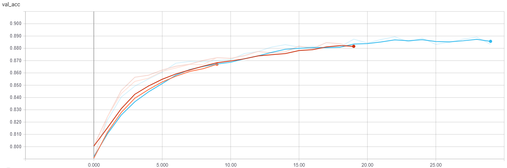

# smile-warrior
This repo contains code used for smile detector for project of Gradient Science Club.

## Training logs:
Data from 3 training sessions, accordingly for 10, 20 and 30 epochs (without augmentation)
### Accuracy:

### Loss:

### Validation accuracy:

### Validation loss:

